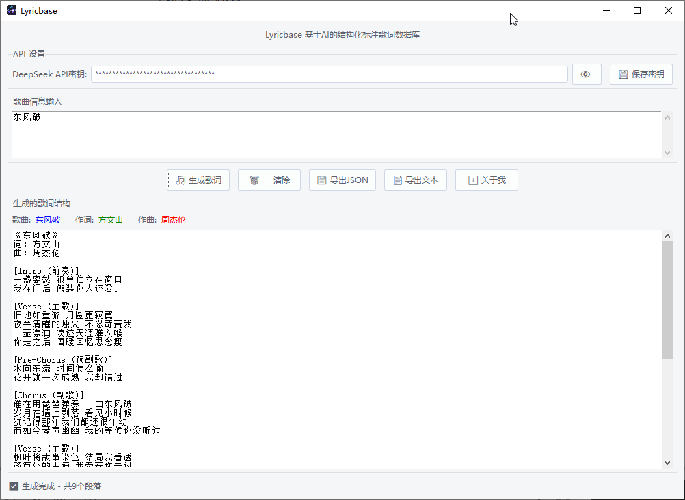
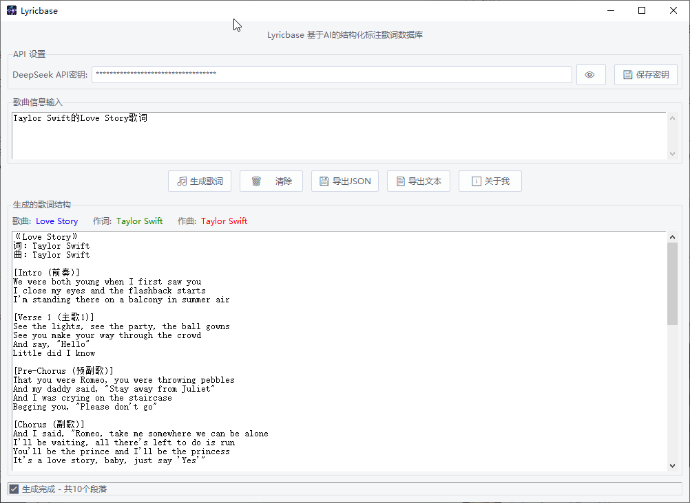

# Lyricbase - 基于AI的结构化标注歌词数据库或者生成器

Lyricbase 是一款基于人工智能的歌词结构标注工具，能够自动分析歌曲并生成带有结构标注的歌词文档。



## 🌟 功能特性

- **AI 歌词生成**：使用 DeepSeek API 自动生成完整歌词
- **智能结构分析**：自动识别歌词段落结构（主歌、副歌、桥段等）
- **多格式导出**：支持 JSON 和纯文本格式导出
- **用户友好界面**：基于 Tkinter 的现代化 GUI 界面
- **一键操作**：简单直观的操作流程

## 🚀 使用方法

### 1. 配置 API 密钥

1. 在顶部 API 设置区域输入您的 DeepSeek API 密钥
2. 点击"保存密钥"按钮保存配置

> **注意**：您需要先注册 [DeepSeek](https://platform.deepseek.com/) 账号并获取 API 密钥

### 2. 生成歌词

1. 在输入框中输入歌曲信息，例如：
   - `周杰伦的《青花瓷》歌词`
   - `请生成《以父之名》的完整歌词`
   - `Taylor Swift的Love Story歌词`

2. 点击"🎵 生成歌词"按钮
3. 等待 AI 处理并生成结果

### 3. 导出结果

- **导出 JSON**：保存为结构化 JSON 文件，包含完整的歌词信息和元数据
- **导出文本**：保存为纯文本格式，便于阅读和编辑

## 📁 文件格式

### JSON 导出格式
```json
{
  "song_info": {
    "title": "歌曲名",
    "lyricist": "作词",
    "composer": "作曲"
  },
  "sections": [
    {
      "type": "段落类型",
      "content": ["歌词行1", "歌词行2"]
    }
  ],
  "raw_text": "原始歌词文本",
  "generated_at": "生成时间戳"
}
```

### 文本导出格式
```
《歌曲名》
词：作者
曲：作者

[Intro]
前奏歌词...

[Verse 1]
主歌歌词...
```

## 📋 支持的功能

- ✅ 自动识别歌曲意图
- ✅ 智能歌词结构分析
- ✅ 多格式导出（JSON/TXT）
- ✅ API 密钥安全保存
- ✅ 响应式用户界面
- ✅ 错误处理和状态提示

## ⚠️ 免责声明

本工具生成的歌词内容基于大语言模型调用，可能存在以下情况：

1. 歌词内容可能不完整或不准确
2. 段落结构分析可能存在误差
3. 请以官方发布的正式歌词版本为准
4. 生成的歌词仅供学习和参考使用

## 👨‍💻 开发者信息

- **Author**: Will Zhou
- **Email**: willzhou@live.com
- **GitHub**: [https://github.com/willzhou](https://github.com/willzhou)

## 🐛 问题反馈

如果您遇到任何问题或有建议，请通过以下方式联系：

1. 在 GitHub 提交 Issue
2. 发送邮件至：willzhou@live.com

---

**感谢使用 Lyricbase！🎵**
